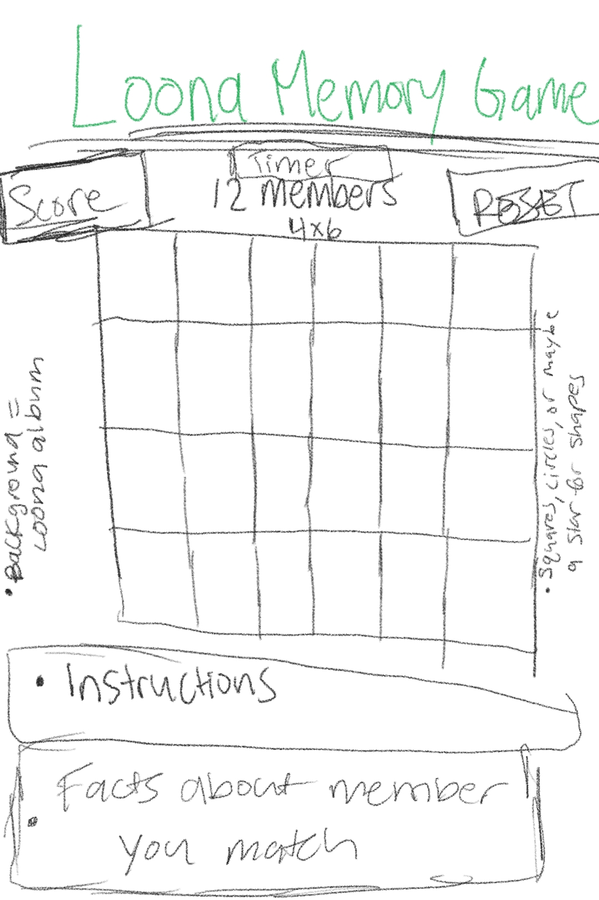

# LOONA (이달의 소녀) Memory Game

## Welcome to LOONA
You might be asking yourself, what is LOONA? LOONA is you, it's me but it's especially the 12 members of a Korean POP group. I've been a fan of LOONA for several years now and I wanted to make a game that was themed around them. I decided a memory matching game would be fun and challenging. 12 members = 24 squares. The goal of the game is to match all 12 members in the least amount of gueses possible. The person with the least amount of gusses wins! Also remember to STAN LOONA! 

### Tech Being Used
* HTML/CSS/JavaScript
* Using grid and flex
* Possibly using bootstrap to style page

### Rough Sketch

Beautiful right? Please excuse my drawing...

## MVP

* Create a 4x6 grid that contains images
* Have a score (# of guesses), and a reset button
* Have the images be started face down and be flipped when they are pressed
* Have only two images be flipped at any given time
* At the start and when the reset button is pressed, have the images be shuffled
* Have instructions somewhere on the page
* Have a backdrop of LOONA (possibly album cover)
* Game state where the game ends when all images have been matched

## Stretch Goals
* Whenever a user gets a match facts about that member will be displayed
* Behind each image have a glowing backdrop of that members representative color
* Have sound effects whenever an image is flipped
* A timer to score instead of # of guesses and have timer stop when game is over