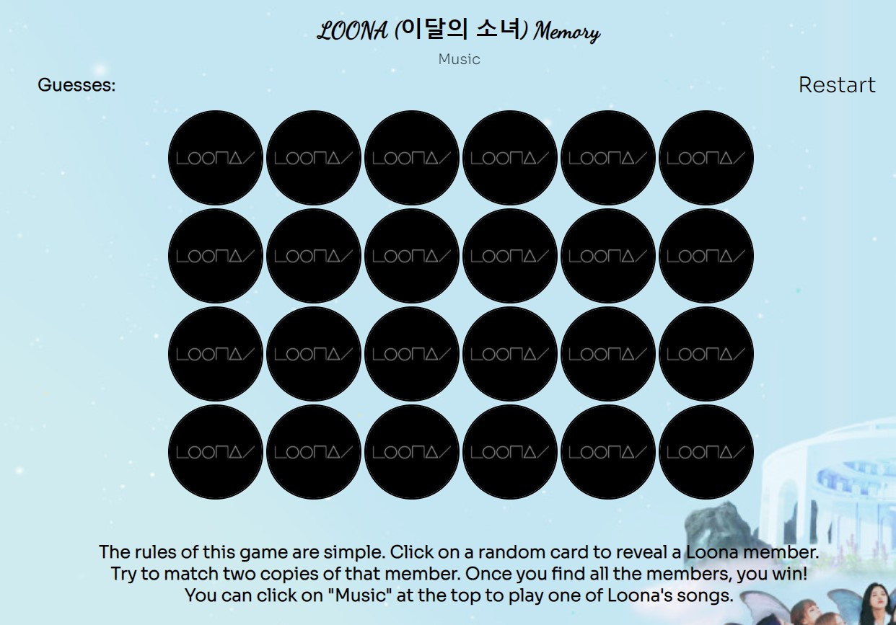

# LOONA (이달의 소녀) Memory Game


## Welcome to LOONA
You might be asking yourself, what is LOONA? LOONA is you, it's me but it's especially the 12 members of a Korean POP group. I've been a fan of LOONA for several years now and I wanted to make a game that was themed around them. I decided a memory matching game would be fun and challenging. 12 members = 24 squares. The goal of the game is to match all 12 members in the least amount of gueses possible. The person with the least amount of gusses wins! Also remember to STAN LOONA! 

### Tech Being Used
* HTML/CSS/JavaScript
* Using grid and flex

### Rough Sketch

Beautiful right? Please excuse my drawing...


### Game Board

Updated Board design


## MVP
* Create a 4x6 grid that contains images [X]
* Have a score (# of guesses), and a reset button [X]
* Have the images be started with the Loona logo and turn into a member once a logo is clicked [X]
* Only be able to reveal two images at a time [X]
* At the start of the game and when the reset button is pressed, have the images be shuffled [X]
* Have instructions somewhere on the page [X]
* Have a backdrop of LOONA (possibly album cover) [X]
* Game ends when all the images are matched and "You Win!" will appear at the top [X]

## Stretch Goals
* Whenever a user gets a match, facts about that member will be displayed [X]
* Have a button that plays a LOONA song. The button can toggle play and pause [X]
* Behind each image have a glowing backdrop of that members representative color []
* A timer to score instead of # of guesses and have timer stop when game is over []

## Resources
* Used this page to find how to properly play and pause music. <a href="https://forum.freecodecamp.org/t/how-to-play-mp3-in-the-background-music-automatically/308554">Click</a>
* I do not own these pictures and music. All were used for educational purposes.

## Code highlights
* A music button with switching icons
```
const musicbutton = document.querySelector("#musicButton");
const audio = document.querySelector("audio");
const icon = document.querySelector("#musicButton > i");

musicButton.addEventListener("click", () => {
  if (audio.paused) {
    audio.volume = 0.2;
    audio.play();
    icon.classList.remove("fa-circle-play");
    icon.classList.add("fa-circle-pause");
  } else {
    audio.pause();
    icon.classList.remove("fa-circle-pause");
    icon.classList.add("fa-circle-play");
  }
});
```
* My win condition that reveals multiple things
```
let winCondition = () => {
  if (correctGuesses >= 12) {
    winMessage.innerText = "You Win!";
    setTimeout(() => {
      extraMessage.style.color = "black";
      extraMessage.innerText = "Welcome to the LOONAVERSE";
      document.querySelector('.gif').classList.remove('hide')
    }, 3000);
  }
};
```